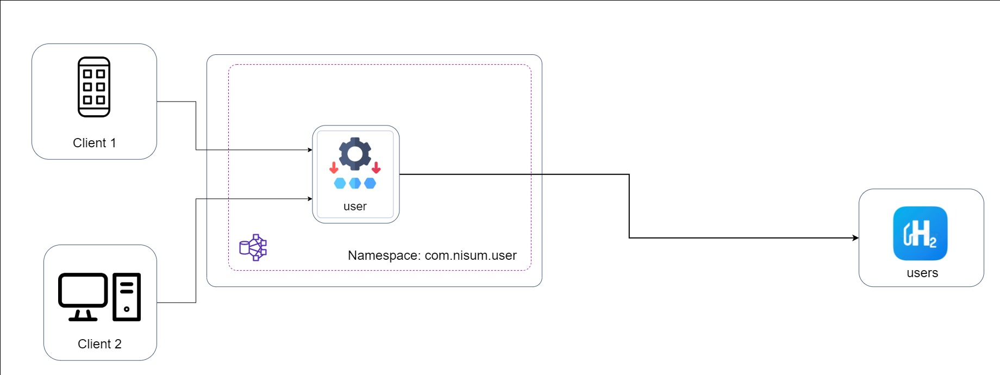
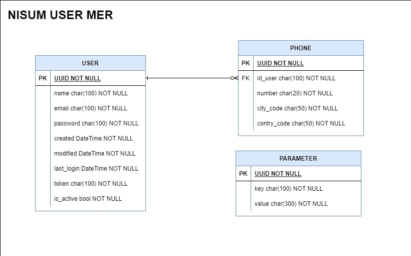
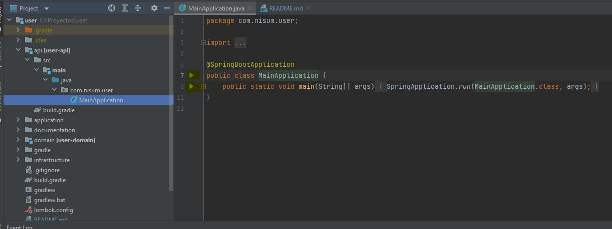

### **Interface component diagram**

The following diagram shows the integration design and the relationship with the different components:



### **MER**

The following diagram shows the entity relationship model of the different tables in the database:



# Deployment in local environment


Download all dependencies from gradle when import the project in the IDE or download from command line and run the main class of the application, that is in the user-api module.


When running the application, the ORM will create the tables in the database.

Postman Collection Link  with the request examples: https://www.getpostman.com/collections/004d2182a4b168f5364d

#### Create a new User **in a local environment**:

**POST http://localhost:8080/user**

Json body
```json
{
   "name":"Juan Rodriguez",
   "email":"juan@rodriguez.org",
   "password":"hunter2",
   "phones":[
      {
         "number":"1234567",
         "citycode":"1",
         "contrycode":"57"
      }
   ]
}
```

Output Json
```json

```

#### Get a User by Email filter **in a local environment**:

**GET http://localhost:8080/user**

Json body
```json
{
  "email":"juan@rodriguez.org"
}
```

####Create or update password regex; is necessary the key field equals PASSWORD-REGEX to configure parameter of password regex **in a local environment**:

**PUT http://localhost:8080/admin/parameters**

Json body
```json
{
    "key": "PASSWORD-REGEX",   
    "value": ".*"
}
```
